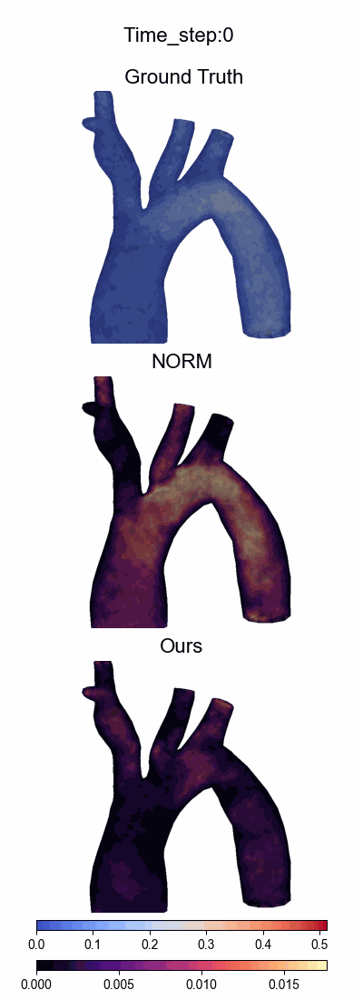
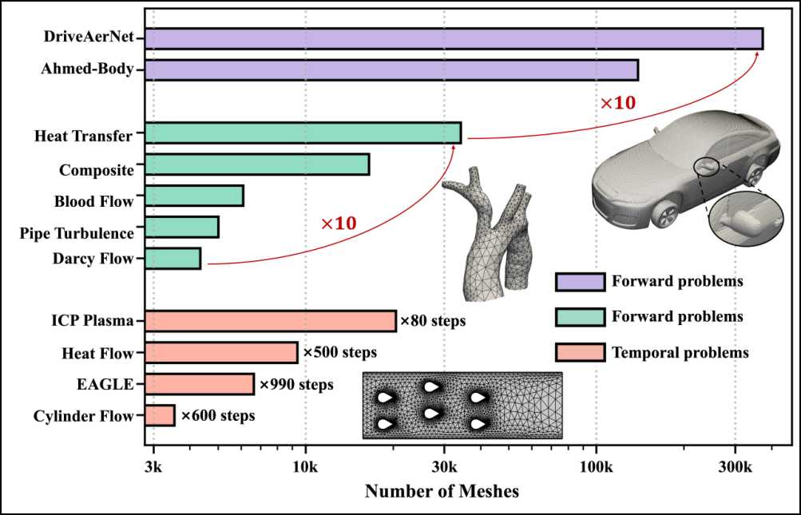
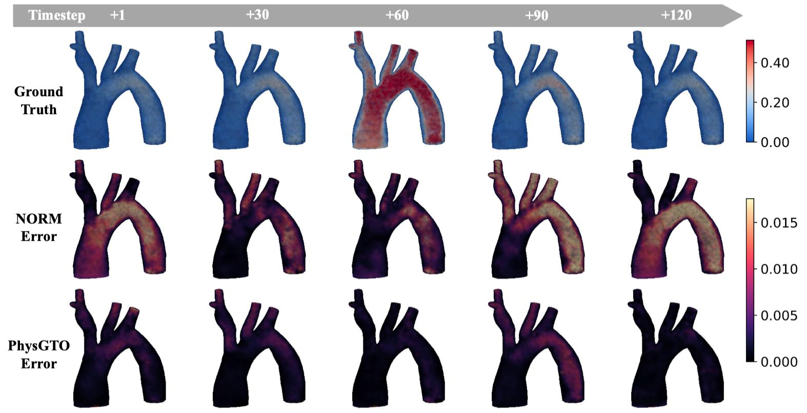
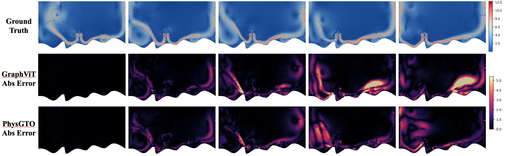
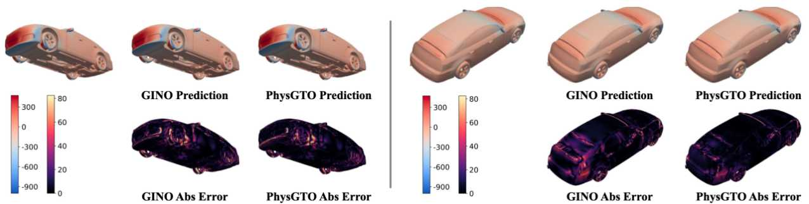

# PhysGTO
**PhysGTO: An Efficient Graph-Transformer Operator for Learning Physical Dynamics with Manifolds Embedding**

In this work, we propose a novel neural operator model for performing end-to-end simulations in computational mechanics. Accurate and efficient physical simulations are essential in science and engineering, yet traditional numerical solvers face challenges in computational cost when handling simulations across scenarios involving complex geometries, varying boundary/initial conditions, and diverse physical parameters. In recent years, while deep learning offers promising alternatives, existing methods often struggle with flexibility and generalization, particularly on unstructured meshes, which significantly limits their practical applicability. To address these challenges, we propose PhysGTO, a Graph-Transformer Operator for learning physical dynamics through explicit manifold embeddings, which can achieve state-of-the-art prediction accuracy while significantly reducing the computational cost compared to advanced deep learning models.

<p align="center">
  
  
</p>

**Visualization results. Left: Visualization of Blood Flow. Right: Visualization of Cylinder Flow.** The first row shows the ground-truth velocity magnitude ($\sqrt{u^2+v^2}$ for 2D, or $\sqrt{u^2+v^2+w^2}$ for 3D), while the second and third rows present the prediction errors (**abs error**) of the state-of-the-art baseline and the proposed PhysGTO, respectively. Here, **abs error** refers to $|\hat{u}(x) - u(x)|$, where $\hat{u}(x)$ and $u(x)$ denote the predicted and ground-truth values, respectively.  

## A comprehensive benchmark spanning eleven datasets

This benchmark suite covers a wide range of forward and temporal PDE problems across eleven diverse datasets, including complex geometries (e.g., car aerodynamics, vascular structures) and fine-grained temporal simulations (up to 990 steps). The datasets vary significantly in spatial resolution and temporal complexity, providing a robust testbed for evaluating physics-informed and surrogate modeling methods. Problems are categorized into steady-state (purple and green) and transient (red) groups, with up to 10× variation in scale.



## Results

PhysGTO is a generalizable surrogate modeling framework designed for challenging physical systems. It excels in capturing complex physical patterns on unstructured meshes, supports reliable long-horizon dynamics forecasting, and scales efficiently to large-scale 3D geometry problems, making it a versatile solution for a wide range of scientific and engineering applications.

### 1.PhysGTO excels in learning complex physical patterns on unstructured meshes



PhysGTO outperforms NORM in modeling complex physical dynamics across unstructured meshes, demonstrating superior generalization on five diverse PDE tasks involving intricate geometries and multi-physics coupling.

### 2.PhysGTO enables reliable dynamics forecasting over long time horizons



PhysGTO consistently outperforms strong baseline models on long-horizon transient flow prediction tasks, demonstrating superior dynamic fidelity and generalization in complex multi-physics systems.

### 3.PhysGTO scales effectively to large-scale 3D geometry problems




PhysGTO surpasses state-of-the-art baselines on large-scale 3D aerodynamic benchmarks, achieving higher accuracy and significantly lower computational cost, while maintaining robust generalization across complex real-world vehicle geometries.

## Get Started

Our model is designed to address three distinct scenarios:

- Task 1: Learning complex physical patterns on unstructured meshes.

- Task 2: Reliable long-term dynamics forecasting.

- Task 3: Scaling to large-scale 3D geometries.

At present, we demonstrate one representative case for each task.

 Please maintain the file structure shown below to run the script by default：

```sh
The project
|
└─── code
|    └─── task1
|          └─── src
|          └─── checkpoints
|                └─── checkpoint.pth
|               ...
|          main.py
|          infer.py
|          utils.py
|    └─── task2
|          └─── config
|          └─── checkpoints
|                └─── checkpoint.pth
|               ...
|          └─── src
|               ...
|          main.py
|          infer.py
|          run_train.sh
|          run_infer.sh
|          utils.py
|    └─── task3
|          └─── config
|          └─── checkpoints
|                └─── checkpoint.pth
|               ...
|          └─── src
|               ...
|          main.py
|          infer.py
|          run_train.sh
|          run_infer.sh
|
└─── data
|    └─── task1
|          ...
|    └─── task2
|          ...
|    └─── task3
|          ...
```


Add dataset folder if it does not exist, add data to corresponding dataset. You should change the environment settings in the file according to your own hardware configuration.

To facilitate quick testing and result demonstration, we provide a mini dataset containing only a single case for each task, along with corresponding pre-trained checkpoints.

- In Task 1, we include Darcy Flow prediction.

- In Task 2, we provide Heat Flow prediction.

- In Task 3, we offer pressure field prediction on the Ahmed-Body dataset.

The datasets and corresponding checkpoints can be downloaded from the links below:

datasets link: https://drive.google.com/file/d/1eXuMTFevrJyk1NjnQX1V4ZWeTrEg0tvk/view?usp=sharing

checkpoints link: https://drive.google.com/file/d/1h7eqbYFZM7Qga5XKV-iF6qYRBQ2HV-6l/view?usp=sharing

**Data Format:**

The geometry format of our dataset (PhysGTO_Dataset) should be as follows:

```python
Node_pos = [
    [X1, Y1, Z1],
    [X2, Y2, Z2],
   ...
]
Cells = [
    [p1, p2, p3],
    [p4, p5, p6],
   ...
]
```
- **X,Y,Z**: (N_points x 3) numpy array(2D or 3D), representing input mesh points. X_dim, Y_dim, Z_dim are input dimensions of geometry.

- **Cells**: (N_cells x 3) numpy array, representing Geometric Cells, which contains three points. The minimum index is `0`, and the maximum value is `N_points-1`.

- **Note**:
    I. For a single sample, The number of points must match, i.e, ``X.shape[0]=Y.shape[0]``, but it can vary with different samples.
    II. If additional preprocessing is required for the data, please modify it in the corresponding dataset file in the directory `code/src`

The field input should be as follows:

```python
input_field1 = [
    [a1, a2, a3...],
    [a4, a5, a6...],
   ...
]
input_field2 = [
    [b1, b2, b3...],
    [b4, b5, b6...],
   ...
]
...
```
- **input_field**: (N_points x C) numpy array, representing the input fields. 

input mesh points. X_dim, Y_dim, Z_dim are input dimensions of geometry.

- **Note**: The input fields in our framework are flexible and task-dependent: they can be absent or numerous depending on the problem setting. <br /> <br />
For example, in 3D vehicle pressure estimation, no additional input fields are required beyond the geometry itself;In unstructured mesh problems, the inputs may include initial states, various physical fields, or other relevant physical information;For long-term dynamics forecasting, the inputs typically consist of the initial conditions, node types, and other auxiliary condition fields. <br /> <br />
Additionally, for temporal problems, we incorporate **explicit time encoding** to further enhance model performance.
This flexible input design significantly improves the model’s ability to adapt and generalize across a wide range of complex scenarios.


## Requirements

- torch==2.1.0
- torch_scatter==2.1.0
- numpy==1.24.3
- pandas==2.0.1
- plyfile==0.7.4
- h5py==3.9.0
- vtk==9.2.6
- tensorboardX==2.6


## Contact

If you have any questions or want to use the code, please contact [liupw@zju.edu.cn](mailto:liupw@zju.edu.cn).

## Contributing

We welcome contributions to improve the dataset or project. Please submit pull requests for review.

